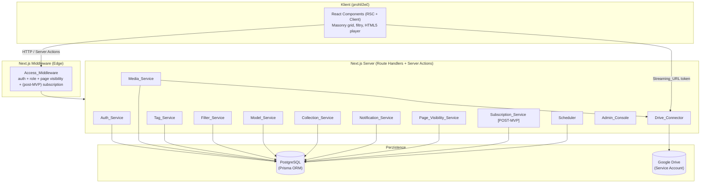
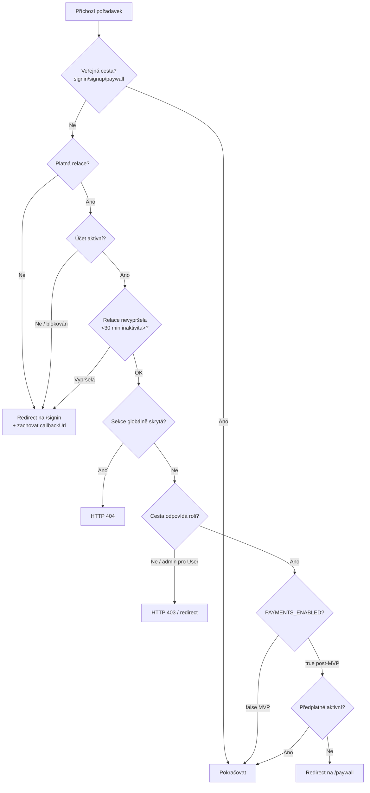
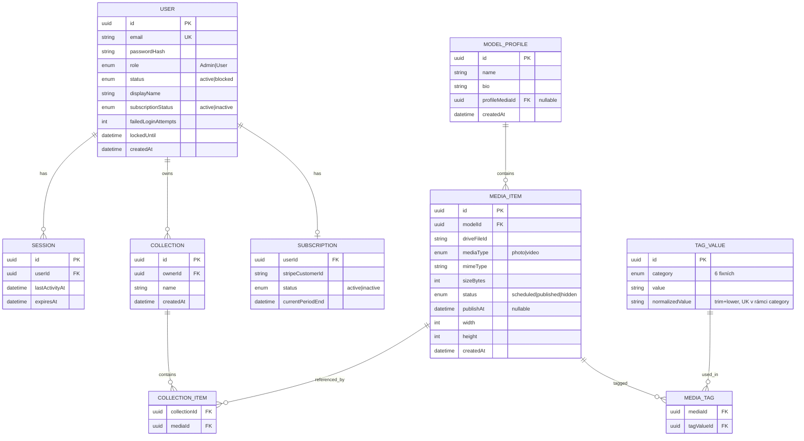
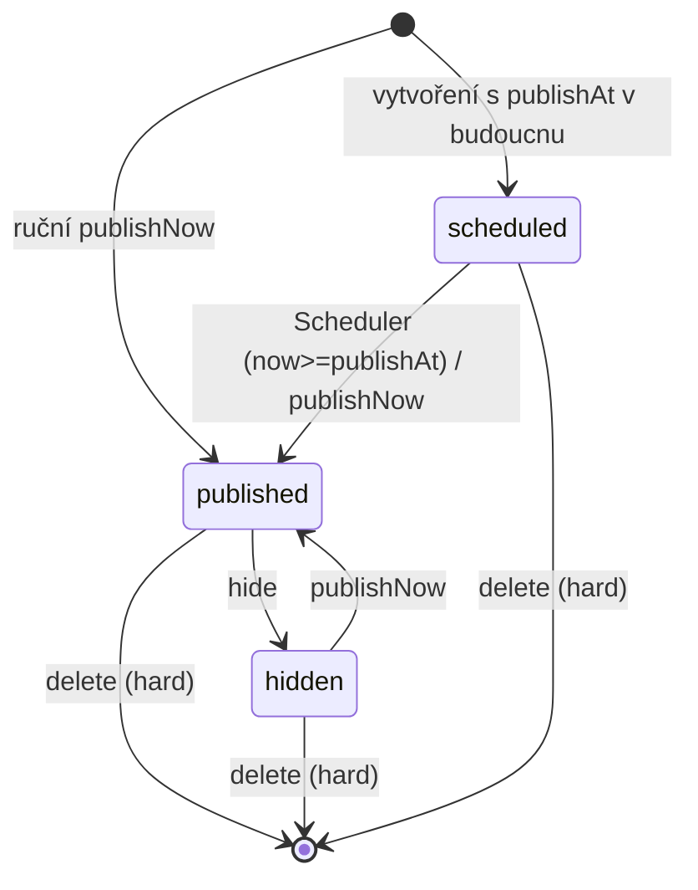

# Design Document — MMMRED Streaming Dashboard

## Overview

MMMRED je privátní Next.js (App Router) aplikace pro streamování autorských kolekcí fotografií a videí v uzavřeném režimu. Tento dokument popisuje architekturu, komponenty, datové modely, korektnostní vlastnosti a strategii testování, které naplňují požadavky z `requirements.md`.

Klíčové designové principy:

- **Uzavřený režim jako výchozí stav.** Veškerý přístup je odepřen, pokud není explicitně povolen. Veřejné jsou pouze `Sign In`, `Sign Up` a `Paywall`; vše ostatní je za autentizační (a v post-MVP fázi i platební) bariérou vynucenou v jediné serverové vrstvě (`Access_Middleware`).
- **Média nikdy nejsou veřejně linkována.** Soubory zůstávají na Google Drive a klient k nim přistupuje výhradně přes časově omezenou, podepsanou `Streaming_URL` směřující na vlastní proxy endpoint aplikace, nikdy na trvalý odkaz Google Drive.
- **Vyhledávání pouze přes chytré filtry.** Žádný fulltext; kombinace multi-select filtrů nad pevnými kategoriemi štítků (OR uvnitř kategorie, AND napříč kategoriemi).
- **Platby jsou feature-flagované.** Logika předplatného (Stripe) existuje, ale v MVP je vypnutá jediným konfiguračním přepínačem; `Access_Middleware` vyhodnocuje předplatné jen v post-MVP režimu.
- **Vizuální styl.** Netflix-style tmavé prémiové UI (pure-black canvas, jediný červený akcent `#e50914`, Netflix Sans / Inter, masonry karty), řízené steeringem `design-system-netflix`. Existující HTML mockupy v `ui-screens/` slouží jako vizuální reference.

### Rozsah MVP vs. POST-MVP

Požadavek 20 (Stripe) a části Požadavku 21 (vynucení v post-MVP režimu) jsou označeny **[POST-MVP]**. Design je navržen tak, aby post-MVP funkce byly přítomné v datovém modelu a vrstvě služeb od začátku, ale vynucení platební bariéry bylo řízeno přepínačem `PAYMENTS_ENABLED` (výchozí `false`).

## Architecture

### Vrstvený model



### Volba technologií

| Oblast | Volba | Zdůvodnění |
|--------|-------|-----------|
| Framework | Next.js 15 App Router, TypeScript | SSR + RSC, jediná code-base pro frontend i backend, integrované middleware pro `Access_Middleware`. |
| UI / styl | Tailwind CSS v4 (`@theme` tokeny z design-system-netflix), Inter (substitut Netflix Sans) | Přímé mapování na design tokeny; mockupy v `ui-screens/` už používají stejné tokeny. |
| Databáze | PostgreSQL + Prisma ORM | Relační model (média ↔ modely ↔ štítky ↔ kolekce), transakce pro atomicitu nahrávání, snadné dotazy pro filtry. |
| Autentizace | Vlastní credentials auth nad **databázovými** session záznamy | DB sessions umožňují revokaci (zablokování účtu ukončí relace do 5 s) a 30min inaktivitu, což čistě JWT neumožňuje. |
| Hashování hesel | `argon2id` (fallback `bcrypt`) | Standardní silné hashování (R2.6). |
| Úložiště médií | Google Drive API přes Service Account (`googleapis`) | Splňuje R5.5; soubory mimo veřejný web. |
| Streamování | Vlastní proxy route handler s krátkodobým podepsaným tokenem | Nikdy neodhalí trvalý odkaz na Drive (R6.3/6.4), platnost ≤ 300 s (R6.1). |
| Plánovač | Cron (každou minutu) → interní endpoint `Scheduler` | Splní publikaci do 60 s (R8.2). |
| Platby | Stripe (`stripe` SDK) za feature flagem | POST-MVP; webhook s ověřením podpisu. |

### Routovací mapa a viditelnost

| Cesta | Přístup | Poznámka |
|-------|---------|----------|
| `/signin`, `/signup` | veřejné | Auth stránky |
| `/paywall` | veřejné | **[POST-MVP]** |
| `/` (Preview/Newsfeed) | User+ | R10 |
| `/search` (Browser) | User+ | R11, R12 |
| `/models`, `/models/[id]` | User+ | R13 |
| `/collections`, `/collections/[id]` | vlastník | R14 |
| `/settings` | User+ | R18 |
| `/admin/**` | pouze Admin | R3, R4, R5, R8, R9, R15, R16, R17 |
| `/api/stream/[token]` | autorizovaný + platný token | R6 |
| `/api/media`, `/api/filter`, … | dle role | chráněné API |

### Tok přístupového rozhodnutí (Access_Middleware)



## Components and Interfaces

Každá komponenta z glosáře je realizována jako serverový modul (service) s čistě typovaným rozhraním. Služby neobsahují HTTP detaily — ty řeší route handlery / server actions, které služby volají. To umožňuje izolované property-based testování čisté logiky.

### Auth_Service

```ts
interface AuthService {
  register(input: { email: string; password: string }): Promise<Result<User, AuthError>>;
  login(input: { email: string; password: string }): Promise<Result<Session, AuthError>>;
  logout(sessionId: string): Promise<void>;
  changePassword(userId: string, current: string, next: string): Promise<Result<void, AuthError>>;
  // čisté pomocné funkce (testovatelné PBT):
  validateEmail(email: string): boolean;            // formát local@domain, délka 5..254
  validatePassword(password: string): boolean;      // délka 8..128
  isLockedOut(user: User, now: Date): boolean;      // 5 chybných pokusů → 15 min blok
}
```

- Hesla se ukládají výhradně jako `argon2id` hash (R2.6).
- Po 5 neúspěšných pokusech se nastaví `lockedUntil = now + 15 min` (R2.8).
- Relace vyprší po 30 min inaktivity; každý úspěšný požadavek aktualizuje `lastActivityAt` (R2.3, R1.6).

### Access_Middleware

Běží jako Next.js `middleware.ts` (Edge) + serverová helper vrstva pro API. Vyhodnocuje pořadí: veřejná cesta → autentizace → stav účtu → inaktivita → page visibility → role → (post-MVP) předplatné. Vrací redirect (stránky) nebo stavový kód (API: 401/403/404). Mód MVP/post-MVP čte z `PAYMENTS_ENABLED` (R21).

```ts
interface AccessDecision {
  outcome: "allow" | "redirectSignIn" | "redirectPaywall" | "deny401" | "deny403" | "deny404";
  callbackUrl?: string; // zachování cíle pro návrat po přihlášení (R21.4)
}
function decideAccess(ctx: RequestContext, config: { paymentsEnabled: boolean }): AccessDecision;
```

`decideAccess` je čistá funkce nad kontextem (cesta, role, stav účtu, čas poslední aktivity, viditelnost sekcí, stav předplatného) — vhodná pro PBT.

### Media_Service

```ts
interface MediaService {
  classifyType(mime: string): "photo" | "video" | null;     // R5.2
  validateUpload(file: UploadMeta): Result<void, UploadError>; // formát + ≤500 MB (R5.3)
  createMediaItem(input: CreateMediaInput): Promise<Result<MediaItem, MediaError>>;
  schedulePublish(id: string, publishAt: Date, now: Date): Promise<Result<MediaItem, MediaError>>;
  publishNow(id: string): Promise<Result<MediaItem, MediaError>>;
  hide(id: string): Promise<Result<void, MediaError>>;
  delete(id: string): Promise<Result<void, MediaError>>;     // hard delete + úklid kolekcí
  isApproved(item: MediaItem, now: Date): boolean;           // PUBLISHED && publishAt<=now
}
```

### Drive_Connector

```ts
interface DriveConnector {
  authenticate(): Promise<Result<void, DriveError>>;          // Service Account / OAuth2 refresh
  upload(file: Buffer, meta: UploadMeta): Promise<Result<{ driveFileId: string }, DriveError>>; // timeout 120 s
  issueStreamingToken(mediaId: string, userId: string, now: Date): StreamingToken; // exp ≤ now+300 s
  verifyStreamingToken(token: string, now: Date): Result<{ mediaId: string }, DriveError>;
  streamFile(driveFileId: string): ReadableStream; // proxy bytes, nikdy nevrací trvalý odkaz
}
```

`StreamingToken` je podepsaný (HMAC/JWT) řetězec obsahující `mediaId`, `userId`, `exp`. Endpoint `/api/stream/[token]` ověří token a teprve poté streamuje obsah přes service account. Trvalý `driveFileId` se nikdy neposílá klientovi.

### Tag_Service

```ts
type TagCategory = "Category" | "Face type" | "Body type" | "Body hair" | "Hair color" | "Clothes";
const FIXED_CATEGORIES: readonly TagCategory[]; // přesně 6, neměnné (R7.1, R7.7)

interface TagService {
  normalize(raw: string): string;                 // trim; porovnání case-insensitive
  upsertValue(category: TagCategory, raw: string): Result<TagValue, TagError>; // R7.2/7.3/7.4
  isValidCategory(name: string): name is TagCategory; // R7.7
}
```

- Normalizace: trim + porovnání bez ohledu na velikost písmen. Nová hodnota délky 1..100 po trim se uloží; existující (case-insensitive shoda) se znovu použije místo duplikace (R7.4).

### Filter_Service

```ts
interface FilterService {
  // OR uvnitř kategorie, AND napříč kategoriemi; prázdný výběr => všechna Approved_Media
  apply(selection: Record<TagCategory, string[]>, pool: MediaItem[], now: Date): MediaItem[];
}
```

Čistá funkce nad množinou Approved_Media a výběrem — ideální pro PBT (R11.3–11.5).

### Model_Service, Collection_Service, Notification_Service, Page_Visibility_Service, Scheduler, Subscription_Service [POST-MVP], Admin_Console

- **Model_Service**: validace jména (1..100) a bio (0..1000); CRUD profilů; galerie vrací výhradně Approved_Media (R4, R13).
- **Collection_Service**: vlastnictví, přidání pouze Approved_Media, idempotentní členství, úklid při smazání média (R9.3, R14).
- **Notification_Service**: singleton banner, text 1..500 znaků, aktivace/deaktivace (R17).
- **Page_Visibility_Service**: perzistentní mapa `section → hidden`, přetrvává napříč relacemi (R16).
- **Scheduler**: cron každou minutu; přepne SCHEDULED→PUBLISHED, kde `publishAt<=now` (R8.2).
- **Subscription_Service [POST-MVP]**: Stripe checkout, ověřené webhooky, stav předplatného (R20).
- **Admin_Console**: agreguje administrátorské operace nad výše uvedenými službami; přístup pouze pro Admin (R3.4).

### Frontend komponenty (Netflix-style)

| Komponenta | Účel | Design tokeny |
|-----------|------|---------------|
| `AppShell` (SideNav + TopNav) | Navigace, jen pro přihlášené | `--color-deep-space`, akcent `--color-netflix-red` |
| `MasonryGrid` | Responzivní masonry, rezervace místa dle poměru stran | sloupce 1 / 2–4 / 5 dle viewportu (R12.1) |
| `MediaCard` | Karta s play overlay, štítky, hover | radius 16px, `feature-card-gradient` |
| `FilterBar` | Multi-select per kategorie, žádný fulltext | R11; pole pro fulltext se nezobrazuje (R11.8) |
| `Html5Player` | Přehrávání přes Streaming_URL | R6.6 |
| `NotificationBanner` | Globální oznámení | R17 |
| `ModelCard` / `ModelDetail` | Artist page | R13 |
| Admin formuláře | Upload, tagging, scheduling, users, pages | R4–R9, R15–R17 |

## Data Models



Doplňkové singleton/konfigurační modely:

- **NOTIFICATION**: `{ id, text, active: boolean, updatedAt }` — zobrazen pouze jeden aktivní banner (R17.5).
- **PAGE_VISIBILITY**: `{ sectionKey: string PK, hidden: boolean }` — perzistentní napříč relacemi (R16.5).
- **APP_CONFIG**: `{ key: "PAYMENTS_ENABLED", value: boolean }` — jediný přepínač režimu, výchozí `false` (R21.3).
- **WEBHOOK_EVENT [POST-MVP]**: log přijatých/odmítnutých Stripe webhooků (R20.5).

### Stavový model Media_Item



`Approved_Media` = `status == published && publishAt <= now`. Pouze taková média jsou viditelná uživatelům (R8.4, R10.2, R13.4).

### Invarianty datového modelu

- Každý `USER` má právě jednu roli z `{Admin, User}` (R3.1); výchozí `User` (R3.2).
- `TAG_VALUE.normalizedValue` je unikátní v rámci `category` (R7.4); kategorie je vždy jedna z 6 fixních (R7.1).
- `COLLECTION` je přístupná pouze `ownerId` (R14.4).
- `MEDIA_ITEM` nese referenci na existující `MODEL_PROFILE` (R4.6, R5.1).
- Jedno `MEDIA_ITEM` má 1..50 `TAG_VALUE` v rámci jedné kategorie (R7.6).

## Correctness Properties

*Vlastnost (property) je charakteristika nebo chování, které má platit napříč všemi validními běhy systému — v podstatě formální tvrzení o tom, co má software dělat. Vlastnosti slouží jako most mezi lidsky čitelnou specifikací a strojově ověřitelnými zárukami korektnosti.*

Následující vlastnosti vycházejí z prework analýzy. Logicky redundantní kritéria byla sloučena (např. invariant viditelnosti pokrývá 8.4/10.2/13.4; komplementární větve přístupu jsou spojeny). Každá vlastnost je univerzálně kvantifikovaná a bude implementována jediným property-based testem.

### Access_Middleware a režimy

### Property 1: Pouze veřejné cesty jsou dostupné bez autentizace
*Pro libovolnou* cestu platí, že je dostupná neautentizovanému návštěvníkovi právě tehdy, když patří do množiny {`/signin`, `/signup`, `/paywall`}; jakákoli jiná cesta vede pro neautentizovaný požadavek na redirect na Sign In (stránka) nebo stav 401 (media API), přičemž se nevrátí žádný chráněný obsah.

**Validates: Requirements 1.1, 1.2, 1.3**

### Property 2: Neautentizovaný přístup zachová cílovou adresu pro návrat
*Pro libovolnou* chráněnou cestu platí, že neautentizovaný požadavek je odepřen a přesměrován na Sign In s `callbackUrl` rovným původní požadované adrese.

**Validates: Requirements 21.4**

### Property 3: Přístup respektuje roli a nikdy neprozradí obsah mimo roli
*Pro libovolnou* kombinaci role a cesty platí, že přístup je povolen právě tehdy, když cesta odpovídá oprávněním role; požadavek uživatele s rolí User na administrátorskou cestu nebo administrátorskou operaci je odepřen (403), neprovede žádnou operaci a nezmění žádná data.

**Validates: Requirements 1.4, 1.5, 3.3, 9.6**

### Property 4: Vypršení relace, zablokování a revokace
*Pro libovolný* stav relace a účtu platí, že požadavek je považován za neautentizovaný (redirect na Sign In) právě tehdy, když relace vypršela (≥ 30 min inaktivity) nebo je účet zablokovaný; po zablokování účtu nezůstane žádná jeho relace platná.

**Validates: Requirements 1.6, 15.3, 15.4**

### Property 5: Platební režim je deterministicky odvozen z přepínače
*Pro libovolnou* hodnotu přepínače `PAYMENTS_ENABLED` a stav předplatného platí: ve vypnutém (MVP) režimu má každý autentizovaný uživatel přístup bez kontroly předplatného; v zapnutém (post-MVP) režimu závisí přístup k chráněnému obsahu a media API na aktivním předplatném (jinak redirect na Paywall). Výchozí hodnota přepínače je vypnuto a každé rozhodnutí čte aktuální hodnotu přepínače.

**Validates: Requirements 20.6, 21.1, 21.2, 21.3, 21.5**

### Property 6: Globálně skrytá sekce vrací 404 a stav přetrvává
*Pro libovolnou* sekci platí, že je-li nastavena jako globálně skrytá, požadavek na její cestu vrátí 404; skrytí a následné zobrazení sekce vrátí viditelnost do původního stavu (round-trip) a nastavený stav viditelnosti přetrvává napříč relacemi až do explicitní změny.

**Validates: Requirements 16.2, 16.3, 16.5**

### Autentizace a role

### Property 7: Validace registračního vstupu
*Pro libovolný* řetězec e-mailu a hesla platí, že registrace uspěje právě tehdy, když e-mail odpovídá formátu local@domain o délce 5–254 znaků a heslo má délku 8–128 znaků; při neplatném vstupu nevznikne žádný účet.

**Validates: Requirements 2.1, 2.7**

### Property 8: Nový účet má právě jednu výchozí roli User
*Pro libovolný* nově vytvořený účet platí, že má přiřazenu právě jednu roli z {Admin, User} a výchozí hodnotou je User; nikdy neexistuje účet bez role nebo s více rolemi.

**Validates: Requirements 3.1, 3.2**

### Property 9: Unikátnost e-mailu při registraci
*Pro libovolný* již registrovaný e-mail platí, že opakovaná registrace téhož e-mailu (porovnání bez ohledu na velikost písmen) je odmítnuta a nevznikne nový účet.

**Validates: Requirements 2.2**

### Property 10: Hesla jsou uložena pouze jako hash
*Pro libovolné* heslo platí, že persistovaná hodnota se nerovná otevřenému heslu a ověření hashe vůči správnému heslu uspěje, zatímco vůči nesprávnému selže.

**Validates: Requirements 2.6**

### Property 11: Round-trip přihlášení a odhlášení
*Pro libovolný* platný účet platí, že po přihlášení existuje platná relace a po odhlášení tato relace již není platná.

**Validates: Requirements 2.5**

### Property 12: Blokace po opakovaných neúspěšných pokusech
*Pro libovolnou* sekvenci pokusů o přihlášení platí, že po 5 po sobě jdoucích neúspěšných pokusech je účet zablokován pro další pokusy po dobu 15 minut a po uplynutí této doby je opět možné se pokusit přihlásit.

**Validates: Requirements 2.8**

### Profily modelů

### Property 13: Round-trip uložení a editace profilu modelu
*Pro libovolné* jméno o délce 1–100 znaků a bio o délce 0–1000 znaků platí, že vytvoření i editace profilu uloží přesně tyto hodnoty a jejich opětovné načtení vrátí stejné hodnoty.

**Validates: Requirements 4.1, 4.4**

### Property 14: Neplatný vstup profilu zachová původní stav
*Pro libovolné* jméno délky 0 nebo > 100 znaků nebo bio délky > 1000 znaků platí, že operace vytvoření je odmítnuta (nevznikne profil) a operace editace zachová původní hodnoty profilu beze změny.

**Validates: Requirements 4.2, 4.3, 4.5**

### Média a streamování

### Property 15: Klasifikace typu média podle formátu
*Pro libovolný* MIME typ platí, že je klasifikován jako foto právě pro JPEG/PNG/WebP, jako video právě pro MP4/MOV/WebM, a jako nepodporovaný (null) jinak.

**Validates: Requirements 5.2**

### Property 16: Validace nahrávaného souboru
*Pro libovolnou* dvojici (formát, velikost) platí, že nahrání je přijato právě tehdy, když je formát podporovaný a velikost ≤ 500 MB; jinak je odmítnuto s uvedením důvodu a nevznikne Media_Item.

**Validates: Requirements 5.3**

### Property 17: Viditelná jsou výhradně Approved_Media
*Pro libovolnou* množinu médií v různých stavech a libovolný čas `now` platí, že každý seznam médií dostupný koncovému uživateli (Preview, galerie modelu, výsledky filtrů) obsahuje pouze média ve stavu published s `publishAt <= now`; média naplánovaná do budoucna, skrytá nebo smazaná se nikdy nezobrazí, přičemž skrytá média zůstávají zachována v úložišti.

**Validates: Requirements 8.1, 8.4, 9.1, 10.2, 13.4**

### Property 18: Preview řadí Approved_Media sestupně dle času zveřejnění
*Pro libovolnou* množinu Approved_Media platí, že výstup stránky Preview je seřazen sestupně podle času zveřejnění.

**Validates: Requirements 10.1**

### Property 19: Plánovač publikuje právě dosažená média
*Pro libovolnou* množinu naplánovaných médií a libovolný čas `now` platí, že po běhu plánovače přejdou do stavu published právě ta média, jejichž `publishAt <= now`, a ostatní zůstanou naplánovaná.

**Validates: Requirements 8.2**

### Property 20: Guardy plánování a publikace
*Pro libovolné* médium platí, že pokus o naplánování nebo publikaci média ve stavu skryté/smazané, nebo nastavení času zveřejnění v minulosti či rovného aktuálnímu času, je zamítnut a stav média zůstane beze změny.

**Validates: Requirements 8.5, 8.6**

### Property 21: Trvalé smazání odstraní záznam i z kolekcí
*Pro libovolné* médium přítomné v libovolných kolekcích platí, že po jeho trvalém smazání záznam média neexistuje a žádná uživatelská kolekce ho již neobsahuje.

**Validates: Requirements 9.2, 9.3**

### Property 22: Streamovací token má omezenou platnost a chrání zdroj
*Pro libovolný* autorizovaný požadavek a čas `now` platí, že vydaný streamovací token vyprší nejpozději za 300 sekund; ověření tokenu uspěje právě tehdy, když `now <= exp`, jinak je přístup zamítnut s indikací vypršení.

**Validates: Requirements 6.1, 6.5**

### Property 23: Neautorizovaný požadavek nevygeneruje token a zdroj se neodhalí
*Pro libovolný* neautorizovaný požadavek na přehrání platí, že nevznikne žádná Streaming_URL; a *pro libovolnou* mediální odpověď serializovanou klientovi platí, že neobsahuje trvalý odkaz na soubor Google Drive (`driveFileId` ani drive doménu).

**Validates: Requirements 6.2, 6.4**

### Štítkovací systém

### Property 24: Množina kategorií je pevná a neměnná
*Pro libovolné* jméno kategorie platí, že je platné právě tehdy, když patří do pevné množiny šesti kategorií; jakýkoli pokus o vytvoření kategorie mimo tuto množinu je odmítnut.

**Validates: Requirements 7.1, 7.7**

### Property 25: Upsert hodnoty štítku normalizuje a deduplikuje
*Pro libovolnou* hodnotu a kategorii platí: hodnota o délce 1–100 znaků po odstranění okrajových mezer, která dosud v kategorii neexistuje (porovnání bez ohledu na velikost písmen), se uloží a zpřístupní; hodnota po trim prázdná nebo > 100 znaků se odmítne; hodnota, která se v kategorii již vyskytuje, nevytvoří duplikát a přiřadí se existující Tag_Value (počet hodnot v kategorii nevzroste).

**Validates: Requirements 7.2, 7.3, 7.4**

### Property 26: Limit počtu hodnot v kategorii na jedno médium
*Pro libovolný* počet hodnot platí, že přiřazení 1–50 různých Tag_Value v rámci jedné kategorie k jednomu médiu je povoleno a pokus o přiřazení více než 50 je odmítnut.

**Validates: Requirements 7.6**

### Chytré filtry a masonry

### Property 27: Filtr — OR uvnitř kategorie, AND napříč kategoriemi, prázdný výběr = vše
*Pro libovolnou* množinu Approved_Media a libovolný výběr filtrů platí, že vrácená média jsou právě ta, která pro každou kategorii s neprázdným výběrem odpovídají alespoň jedné zvolené hodnotě (OR) a současně splňují všechny kategorie s neprázdným výběrem (AND); je-li výběr zcela prázdný, vrátí se všechna Approved_Media.

**Validates: Requirements 11.3, 11.4, 11.5**

### Property 28: Nabídka filtrů odpovídá dostupným hodnotám
*Pro libovolnou* množinu Tag_Value platí, že na stránce Search se zobrazí právě ty kategorie, které mají alespoň jednu hodnotu, a každá zobrazená kategorie nabízí všechny své aktuální hodnoty; kategorie bez hodnot se nezobrazí.

**Validates: Requirements 11.1, 11.2**

### Property 29: Počet sloupců masonry podle šířky viewportu
*Pro libovolnou* šířku viewportu platí, že počet sloupců je 1 pro šířku do 600 px, 2 až 4 pro šířku 600–1200 px a 5 pro šířku nad 1200 px.

**Validates: Requirements 12.1**

### Property 30: Stránkování donačítá bez překryvů a korektně končí
*Pro libovolnou* množinu Approved_Media platí, že postupné donačítání po dávkách o velikosti nejvýše 24 pokryje celou množinu bez duplicit a bez mezer a po vyčerpání dat se donačítání ukončí (indikace konce).

**Validates: Requirements 12.2, 12.6**

### Privátní kolekce

### Property 31: Round-trip přidání a odebrání média v kolekci
*Pro libovolnou* kolekci a libovolné Approved_Media platí, že přidání dosud nepřítomného média ho do kolekce zařadí a následné odebrání ho odebere, čímž se kolekce vrátí do původního stavu.

**Validates: Requirements 14.2, 14.3**

### Property 32: Kolekce je přístupná pouze vlastníkovi
*Pro libovolnou* kolekci a libovolného uživatele platí, že přístup je povolen právě vlastníkovi; požadavek jiného uživatele je odepřen se stavem 403.

**Validates: Requirements 14.1, 14.4, 14.5**

### Property 33: Validace názvu kolekce
*Pro libovolný* název platí, že vytvoření kolekce uspěje právě tehdy, když má název délku 1–100 znaků; jinak je odmítnuto a nevznikne kolekce.

**Validates: Requirements 14.6**

### Property 34: Guardy členství v kolekci
*Pro libovolnou* kolekci platí, že přidání média, které není Approved_Media, je odmítnuto a kolekce zůstane beze změny; a odebrání média, které v kolekci není přítomné, kolekci nezmění a vrátí chybu.

**Validates: Requirements 14.7, 14.8**

### Globální oznámení

### Property 35: Validace a singleton oznamovacího banneru
*Pro libovolný* text platí, že aktivace oznámení uspěje právě tehdy, když má text délku 1–500 znaků; po aktivaci je vždy aktivní nejvýše jeden banner a aktivace dalšího oznámení nahradí text předchozího.

**Validates: Requirements 17.1, 17.3, 17.5**

### Property 36: Round-trip aktivace/deaktivace a doručení novým relacím
*Pro libovolné* oznámení platí, že aktivace a následná deaktivace vrátí stav do "žádný banner"; a po dobu, kdy je oznámení aktivní, je jeho aktuální text doručen každé nově vzniklé relaci.

**Validates: Requirements 17.2, 17.4**

### Nastavení profilu a hesla

### Property 37: Round-trip uložení profilu a validace polí
*Pro libovolné* hodnoty profilu platí, že uložení s platnými hodnotami je perzistuje a opětovné načtení je vrátí; uložení s neplatným polem (prázdné povinné pole nebo hodnota > 255 znaků) je odmítnuto a původní hodnoty zůstanou beze změny.

**Validates: Requirements 18.1, 18.2**

### Property 38: Změna hesla respektuje stávající heslo a délku
*Pro libovolnou* dvojici (stávající heslo, nové heslo) platí, že změna uspěje právě tehdy, když je zadáno správné stávající heslo a nové heslo má délku 8–128 znaků; jinak zůstane heslo nezměněné.

**Validates: Requirements 18.3, 18.4, 18.5**

### Telegram

### Property 39: Přesměrování na Telegram dle platnosti URL
*Pro libovolnou* nakonfigurovanou hodnotu URL platí, že akce Telegram provede přesměrování právě tehdy, když je URL neprázdný řetězec s platným formátem URL; jinak se přesměrování zruší a zobrazí se chyba o nedostupném cíli.

**Validates: Requirements 19.1, 19.3**

### Předplatné [POST-MVP]

### Property 40: Přechody stavu předplatného z ověřených webhooků
*Pro libovolný* ověřený Stripe webhook platí, že událost úspěšné platby nastaví předplatné na aktivní a událost selhání/vypršení na neaktivní.

**Validates: Requirements 20.3, 20.4**

### Property 41: Neověřitelný webhook nemění stav
*Pro libovolný* webhook s neplatným podpisem nebo původem platí, že je odmítnut, nezmění stav předplatného žádného uživatele a je zaznamenán pokus o neoprávněný webhook.

**Validates: Requirements 20.5**

### Property 42: Nový účet má výchozí neaktivní předplatné
*Pro libovolný* nově vytvořený účet platí, že jeho výchozí stav předplatného je neaktivní.

**Validates: Requirements 20.7**

## Error Handling

Všechny služby vrací typovaný `Result<T, E>` (success/failure), nikdy nevyhazují neočekávané výjimky přes hranici služby. Route handlery mapují chyby na HTTP odpovědi a UI je zobrazuje v Netflix-style chybových stavech.

| Kategorie | Strategie | Požadavky |
|-----------|-----------|-----------|
| Autentizace/autorizace | 401 (neautentizován), 403 (mimo roli/cizí kolekce), 404 (skrytá sekce); generická chybová zpráva u přihlášení bez prozrazení pole | R1, R3, R14.5, R16.3, R2.4 |
| Validace vstupu | Odmítnutí s konkrétní chybou pole, zachování původního stavu, žádný částečný zápis | R2.7, R4.2/4.3/4.5, R7.3, R14.6, R17.3, R18.2 |
| Google Drive | Popisná chyba při selhání/timeoutu (120 s) i selhání autentizace; transakční rollback, žádný osiřelý záznam | R5.4, R5.6 |
| Streamování | Zamítnutí vypršelého/neautorizovaného tokenu s jasnou indikací | R6.2, R6.5 |
| Neplatný stav média | Zamítnutí operace, zachování stavu, chybové hlášení | R8.5, R8.6, R9.5 |
| Donačítání médií | Zachování zobrazených položek, chybové oznámení s možností opakovat | R12.5 |
| Prázdné stavy | Explicitní prázdný stav místo chyby (Search, Models, přehled uživatelů) | R11.7, R13.3, R13.5, R15.6 |
| Selhání perzistence | Zachování předchozího stavu, chyba adminovi (viditelnost, stav účtu) | R15.7, R16.4 |
| Stripe webhook [POST-MVP] | Odmítnutí neověřeného webhooku, žádná změna stavu, audit log | R20.5 |
| Atomicita | DB transakce pro nahrávání médií, přiřazení štítků a úklid kolekcí při smazání | R5.1, R9.3 |

## Testing Strategy

### Dvojí přístup

- **Unit testy** — konkrétní příklady, hraniční a chybové případy a integrační body.
- **Property-based testy** — univerzální vlastnosti z kapitoly Correctness Properties napříč generovanými vstupy.
- **Integration / smoke testy** — pro externí závislosti (Google Drive, Stripe), kde se chování nemění smysluplně se vstupem.

### Knihovna a konfigurace property testů

- Cílový jazyk: TypeScript. Property-based knihovna: **`fast-check`** (nepsat PBT od nuly).
- Každý property test běží **minimálně 100 iterací** (`fc.assert(..., { numRuns: 100 })`).
- Každý property test je otagován komentářem odkazujícím na vlastnost z designu ve formátu:
  `// Feature: mmmred-streaming-dashboard, Property {číslo}: {text vlastnosti}`
- Každá korektnostní vlastnost (Property 1–42) je implementována **jediným** property-based testem.
- Čistá jádra služeb (`decideAccess`, `validateEmail/Password`, `classifyType`, `validateUpload`, `isApproved`, `Tag_Service.normalize/upsertValue`, `Filter_Service.apply`, `columnsForWidth`, streamovací token, členství v kolekci, validace názvů/textů) jsou navržena bez I/O, aby byla přímo testovatelná generátory.

### Generátory (arbitraries)

- E-maily (platné i neplatné dle local@domain, hranice 5/254), hesla (hranice 8/128), jména (0/1/100/101), bio (0/1000/1001), texty oznámení (0/1/500/501), názvy kolekcí.
- MIME typy (podporované foto/video i nepodporované), velikosti souborů kolem 500 MB.
- Štítky: hodnoty s okrajovými mezerami, různá velikost písmen, prázdné/whitespace, délky kolem 1/100; množiny kategorií.
- Množiny Media_Item napříč stavy (scheduled/published/hidden) s různými `publishAt` a `now`.
- Výběry filtrů napříč 6 kategoriemi (prázdné i kombinované).
- Šířky viewportu (hranice 600/1200), pozice scrollu a velikosti datasetů pro stránkování.
- Časy a session stavy pro expiraci (kolem 30 min) a streamovací tokeny (kolem 300 s).
- Hodnoty přepínače `PAYMENTS_ENABLED` × stav předplatného × role × cesta pro `decideAccess`.

### Unit a integration testy (mimo PBT)

- **EXAMPLE** kritéria: 2.3, 2.4, 3.4, 6.3, 6.6, 8.3, 9.4, 9.5, 11.6, 11.8, 12.3, 12.4, 12.5, 15.1, 15.2, 15.7, 16.1, 16.4, 19.2, 20.8, 20.9 — cílené unit/UI testy.
- **EDGE_CASE** kritéria: 4.6, 7.7, 11.7, 13.2, 13.3, 13.5, 13.6, 15.6 — pokryto generátory v příslušných property testech nebo cílenými testy prázdných/chybových stavů.
- **INTEGRATION** (mock Google Drive / Stripe): 5.1, 5.4, 5.6, 20.1, 20.2 — 1–3 reprezentativní scénáře.
- **SMOKE**: 5.5 — jednorázové ověření autentizace Drive_Connector s konfigurací.

### UI testy

- Snapshot/komponentní testy pro Netflix-style komponenty (MasonryGrid, MediaCard, FilterBar, NotificationBanner) ověřující design tokeny a absenci fulltextového pole (R11.8).
- Ověření, že přehrávání používá HTML5 player a proxy Streaming_URL (R6.3, R6.6).
